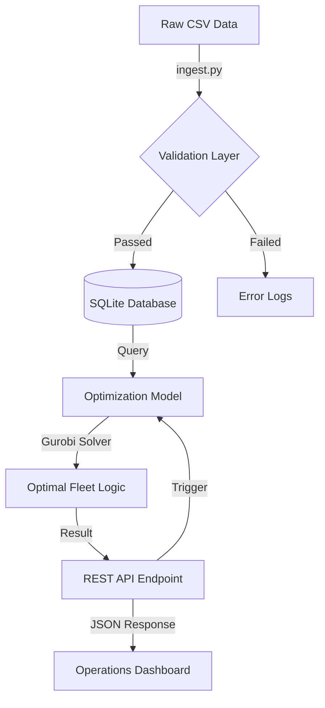

# Logistics Network & Distribution Optimizer

An end-to-end analytics engine that operationalizes logistics network design by integrating validated ETL pipelines with Mixed-Integer Programming solvers to maximize distribution profitability.

## 🚀 Project Overview
This project transforms a standard mathematical optimization problem into a scalable microservice. It leverages **Mixed-Integer Programming (MIP)** via Gurobi to maximize daily operational profit by optimally placing vehicles and assigning customer demand nodes.

### Core Features
- **ETL Pipeline**: Automated ingestion from raw CSV files to a validated Relational Database (SQLite).
- **Data Integrity**: Multi-layered validation using **Pydantic** for schema enforcement and logic constraints.
- **Optimization Engine**: High-performance solver logic using **Gurobi 12.0**.
- **RESTful Interface**: A stateless API built with **FastAPI** to operationalize logistics decisions.

---

## 🏗 System Architecture

The following diagram illustrates the data flow from raw source to actionable decision output.



### Folder Structure
```text
supply_chain_optimization_repo/
├── data/
│   ├── raw/             # Source CSV files
│   └── processed/       # SQLite production database
├── src/
│   ├── api.py           # FastAPI application & routes
│   ├── database.py      # SQLAlchemy models & DB connection
│   ├── ingest.py        # ETL & Ingestion logic
│   ├── models.py        # Pydantic schemas for validation
│   └── optimizer.py     # Gurobi mathematical formulation
├── logs/                # Pipeline and application logs
├── requirements.txt     # Python dependencies
└── README.md            # Technical documentation
```

---

## 🛠 Setup & Installation

### 1. Prerequisites
- Python 3.10+
- Gurobi License (Academic or Commercial)

### 2. Installation
```bash
# Clone the repository
git clone <repo-url>
cd supply_chain_optimization_repo

# Create and activate virtual environment
python3 -m venv venv
source venv/bin/activate  # On Windows use venv\Scripts\activate

# Install dependencies
pip install -r requirements.txt
```

### 3. Run Ingestion (ETL)
Populate the database from raw CSV files:
```bash
python3 -m src.ingest
```

### 4. Start the API
Launch the logistics optimization microservice:
```bash
uvicorn src.api:app --reload --port 8000
```

---

## 🔌 API Specification

### `POST /optimize`
Triggers the optimization engine based on current database state.

**Response Example:**
```json
{
  "status": "OPTIMAL",
  "optimal_profit": 3710.0,
  "chosen_trucks": ["truck8", "truck16", "truck26"],
  "assignments": {
    "truck8": ["demand0", "demand1", "demand2"]
  }
}
```

---

## 🎯 Resume Alignment

This project specifically highlights these **Data Engineering** skills:
- **Data Pipeline Construction**: Moving data from Bronze (CSV) to Gold (SQL Relational) storage.
- **Microservices Implementation**: Wrapping complex algorithms in RESTful APIs.
- **Relational Data Modeling**: Designing optimized SQL schemas using SQLAlchemy.
- **Data Quality Control**: Implementing strict validation contracts via Pydantic.
